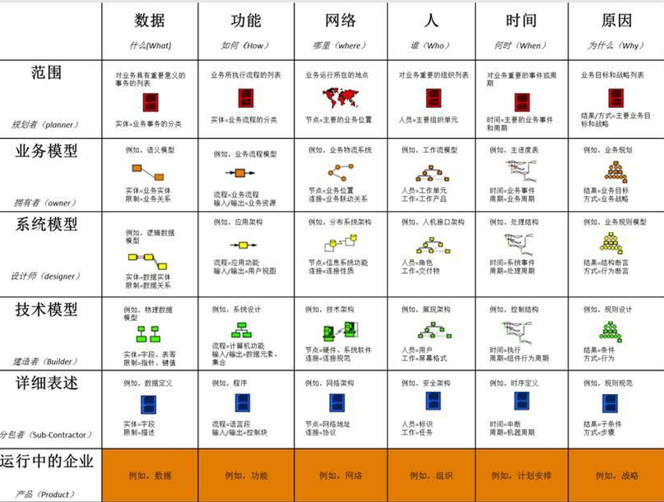
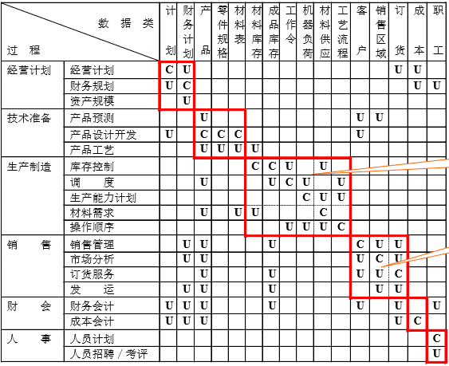
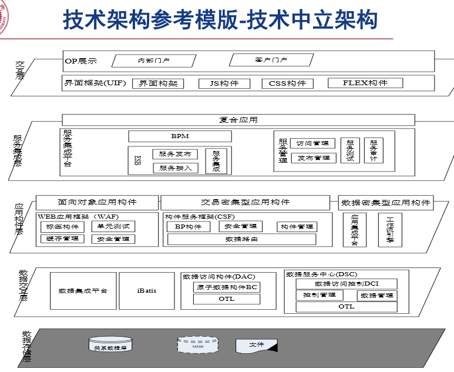
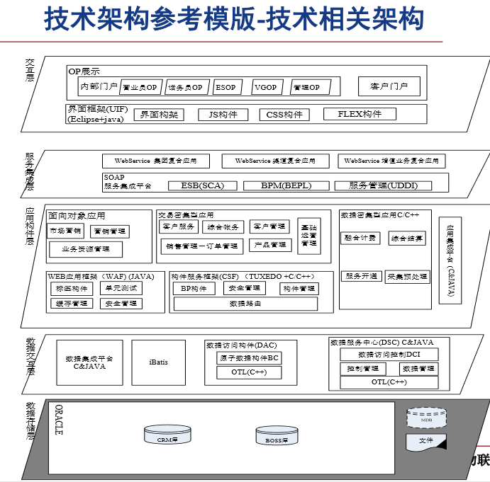

# 信息系统开发例说

## 1. 基于实践，编写开发计划

### 典型信息系统
- 站在欠缺经验的开发者角度考虑
    - 规划系统、建立计划、Use Case、ER、DFD 一直到系统实现，逐步勾画
    - 之后再改进，到系统化、软件工程化层面讨论

### 如何编制好的计划
1. 这是什么项目
2. 如何分解系统
3. 如何安排好项目进度、人员、资金
4. 如何考虑知识产权问题

- 基于实践
    - 脚踏实地，规范明确的文档

### 这是什么项目

以酒店为例

- 了解酒店背景
    - Negative - 脱离实际、空泛虚无
    - Positive - 各种数据实体
        - e.g. 
            - 部门、员工、客房分类及数量、楼层层数、客房分布
- 系统目标
    - Negative - 脱离实际、空泛虚无
        - e.g.
            - “优秀的”、“先进的”、“稳定的”
            - “等功能”、“等特点”
    - Positive - 具体功能
        - e.g.
            - 预定、接待、退房、账单

- 酒店组织架构图
    - 图标规范
    - 展开均衡
    - 颜色合适
    - 辅以表格、文字等
- 业务流程
    - 流程图中，除了业务本身，最好包括相应人/数据对象
    - 适当忽略细节功能
- 系统硬件网络环境
    - 全局性布局，抓住重点
    - 与业务相关的部分

### 如何分解系统

- 把系统分成几个子系统
    - 粒度应均衡
    - <b>有时甚至需要业务过程再造</b>
        - 引入信息系统后业务流程可能改变
        - <b>让业务适应信息系统，而不是信息系统适应落后的业务</b>
- 明确子系统功能
    - 详细定义、说明
- 确定软硬件配置
    - 多方协商。不仅仅是软件工程师
    - 预算

### 如何安排好项目计划

- 时间：软件过程模型
    - 根据实际选用
    - 传统 瀑布模型、旋转模型、原型模型等
        - 大型项目应采用瀑布模型，做好需求分析、系统建模、软件设计，而不着急编码
    - 现代 XP模型、SCRUM模型
        - 规模较小，快速开发
    - 实际项目开发中中，可以在分析阶段使用原型设计开发，明确系统需求；编程阶段，结合使用 xp，成对编程等方式，保证质量；测试维护阶段，不断根据用户反馈，螺旋式更新改进
    - Main Idea
        - 使用专业软件工具制作进度计划表
            - 信息工程主要思想方法： <b>利用工具，将方法至于工具之中，用工具帮助和控制人的工作</b>
        - 使用表格而不是文字
        - 时间使用周为单位‘
        - 根据每个项目具体情况，设计、描述进度计划
- 资金：为测试、维护留有余地，-40-20-40原则
    - 工作量分配：前期 40%，中期 20%，后期 40%
    - 后期工作量、难度相当大
        - 测试、运维等
    - 根据时间、人员、工作内容计划，给出有说服力的资金预算
- 人员：人件与风险管理
    - 针对软件人员
        - 舒适的环境
            - 进取的气氛、开心的心境、创造的欲望
        - 风险意识
            - Deadline 控制
                - 微软等采用区间式 Deadline
    - 有备无患（防止人员流动等）
        - 重要岗位后备
            - 程序员 测试员 交换；项目经理配备助手
        - 规范文档记录

### 如何考虑知识产权问题
- 不仅仅是正版盗版软件问题
- 甲方责任与义务
- 乙方延期的处罚
- 谁拥有该系统
    - 规定好比如：甲方 30%，乙方 70%；使用权；违规赔偿等
    - <b>不因合同双方发生收购、兼并、重组、分立而发生变化</b>

### 如何编号系统开发计划书
- 整洁明确的封面，涉及的系统与内容、文档版本、作者、小组成员、单位、联系方式、编制日期
- 文档版本记录表，记录版本变化历史
- 文档控制页
    - 多方签字认可
- 图表、缩写语索引

## 2. 观察实践，分析需求

大型系统开发需要瀑布型过程模型，工程化方法和管理

### 需求分析
1. 宏观上把握系统
    - 把握系统要做什么
        - 功能图
        - 系统Use Case
2. 微观上确立概念
    - 建立系统概念模型
        - E-R图
        - 类图
        - 数据字典
3. 流程上明确需求
    - 勾画数据流、控制流、对象之间的相互关系
        - DFD图
        - 对象交互图
        - IPO图

### 从宏观把握系统 - Use Case

- 适用于宏观场景描述，表达角色与软件之间的交互关系，不适合描述程序流程。
- 从用户角度观察系统需求，不适合表述系统分解模型

1. 前后绘图的业务、功能的完整性应保持一致
2. 概念名称应保持一致
    - e.g. 餐娱消费
3. 动词+名词 详细描述业务，而不是仅仅一个名词
    - e.g. 查询 -> 查询账单
- 软件工程开发思考原则：<b>前后一贯，左顾右盼</b>
4. 不应该引入 登录 等控制流、软件过程
5. 相同工具绘制

### 从微观明确概念 - 系统概念模型
- 考虑、定义每一个概念与数据
- 根据概念模型到处对象类、数据库表
1. ER图
    - 有哪些概念、它们相互之间的关系
    1. 同一个 ER图中，粒度应保持一致
        - 部门 ER图中就只出现部门，不需要出现 客人等细粒度概念实体
    2. 前后一贯，左顾右盼
2. 概念定义 - 数据表
    - 每个概念包含哪些数据
    - 数据的具体定义
    1. 前后一贯
        - 客人 客户；客房 房间
    2. 完整性 不能遗漏
    3. 每个数据项都要展开、定义
3. 概念定义 - 数据字典
    - 类型
    - 前后一致
    1. 所有概念、数据定义汇总在字典后，并排序
        - 按英文名称
        - 按中文名称
        - 按编号

### 从流程明确需求 - DFD IPO
DFD 数据流动视角，动态模型；ER 静态模型
- 数据层面，不能代表控制流
- 软件系统以控制流控制的代码来实现数据流的处理
1. DFD
    - DFD 需要自顶向下不断细化，底层数据流可以很细
    - 箭头表示数据流，应该用名词命名
2. IPO
    - Input -> Process -> Output
    - 根据此来设计测试用例

## 3. 深入实践，建立 UML 模型
- 多视角分析
    - E-R，DFD等分析系统需求
    - 面向对象

### 面向对象
- 把软件要处理的客观世界中的物件提炼出来
- 多态、封装、继承

### 哪些是本系统的对象 - 静态 Class 图
- E-R 图是很好的参照
    - 实体基本上对应对象
    - 实体间的关系基本上就是对象类之间的关系

#### 系统 Class 图
- 聚合组成
- 继承
    - 子类若无独立属性、行为，则没有必要存在
- 关联

#### 系统 GUI 类图
- 设计基本上要与 Use Case 和子系统功能分布对应
- 左顾右盼，前后一致

## 如何用对象实现系统 - 动态 Sequence 图

描述相应行为属于哪个对象、对象与行为之间如何交互

- 如果序列图中，某个对象没有被使用过，说明是不需要的
- 泳道上出现的操作一定属于这个对象
- <b>一张序列图描述一个 Use Case</b>

### 如何编好系统需求规范说明书 - SRS

前面形成的开发计划书是SRS重要前导文件， SRS 必须 根据计划书中的基本要求和宏观架构进一步细化分析数据 模型、面向对象模型

- 计划书与SRS保持一致

## 4. 围绕实践，设计系统架构与部件

### 4.1 如何考虑系统架构
每个架构之间不一定矛盾

- 以数据为中心的体系架构
    - 信息管理系统基本都是这个
- 分层体系架构
- 三层体系架构
- 调用/返回体系架构 
- 面向对象体系架构：总线式体系架构 

#### 4.1.1 以数据为中心的体系架构
- 以数据为中心的体系架构主要针对以数据库为基础的软件系统
    - 大量数据的保存、检索是系统的基本要求

#### 4.1.2 分层体系架构
- 分层体系架构是从软件之间的相互依赖关系出发来观察、 描述软件之间的架构
    - 如一般软件系统的核心是操作系统 ，然后是数据库等支撑系统，外层是各种语言的应用软件 系统。

#### 4.1.3 三层体系(C/S, B/S)架构
- 基于网络的发展，现在的软件都需要在网络上运行，因此又时常以三层体系架构的形式出现 如 Client/Server. Browser/Server 架构 

#### 4.1.4 调用/返回体系架构
- 调用/返回( Call and Return )体系是传统的面向过程方 法对软件架构的基本认识，认为软件是由一个个过程(子 程序)组成的，软件的架构主要是主程序调用子程序、上 级程序调用下级程序、被调用程序将运行结果返回给调 用程序，这样所形成的一种层次休系 

#### 4.1.5 面向对象体系架构
- 实现对象交互的一种有效的 架构形式是通过对象请求代理( Object Request Broker )机制，仿佛在对象之间构筑一条消息“ 总线”， CORBA、 DCOM、 EJB 都是这种架构的体现
- 以 Web 后端为例，自己在做程序设计时思想还是面向过程，但是 Controller，Service 那一套分层体系实际上属于面向对象。Controller 实际就是 ORB 的总线式请求代理。

### 4.2 如何组织对象部件——Package 图

与软件工程导论相同

### 4.3 如何设计对象部件

包中的各个对象类，最终要通过部件设计去实现。部件( 或称组件)是实现对 象类的软件模块单位

一个对象类需要一个对应的实现部件， 一个 部件也可以包括几个相关的对象类 

- Class 类图
    - 面向对象
    - 只不过方法应该用伪代码或其他方式实现
    - 按照面向对象方法，预订登记、预订更改、预订删除都 是"预订"对象类中的操作，

- Activity 活动图
    - 面向过程
    - 完全用过程设计的思路来实现“预订”模块的所 有功能，包括预订登记、预订更改、预订删除，所以就有了 预订方式选择等分支
    -  以过程为单位组织软件模块，没有任何的对象复 用、封装等，当其他软件要利用其中的某些操作时，非 常不方便

- State 状态图
    - 主要描述某个对象或者系统内部，由于外 部事件和软件行为而引起的状态迁移 

- Swimlane 泳道图
    - 将对象交互与对象内部操作过程结合 在一起描述，既有对象交互的外部视角，也有对象操作过 程的内部视角

## 总结
本讲实例基本上是按照瀑布型模型组织过程和文档的，因此在每个阶段都全 面展开对每个子 系统的分析设计

如果开发过程和文档按照渐增方式或者螺旋方式组织实施，效果又会怎样? 

# 信息系统顶层设计

顶层设计是运用系统论的方法，从全局的角度，对某项任务或者某个 项目的各方面、各层次、各要素统筹规划，以集中有效资源，高效快 捷地实现目标 

- 概要
    - 特征
        - 顶层决定性
        - 整体关联性
        - 实际可操作性

    - 顶层设计技术分类解析
        - 需求开发
            - 通过规范的需求描述形式对需求开发的内容进行组织，使决策人员 、系统设计人员能迅速从描述中提取需求，便于系统开发团队内部 的沟通和需求追溯 
            - 过程
                - 需求获取
                - 需求描述
                - 需求分析
                - 需求验证需求
            - 文档形式
            - 三种主流需求描述方法
                - UML
                    - Use Case
                    - 静态图
                        - 类图
                            - 对象图
                        - 包图
                    - 行为图
                        - 状态图
                        - 活动图
                        - 时序图
                - IDEF
                - 视图
            - 四种需求分析方法
                - 基于场景的需求分析方法
                - 基于目标的需求分析方法
                - 基于威胁的需求分析方法
                - 基于能力的需求分析方法

        - 体系结构设计
            - 从总体上把握系统的结构，确定系统 与外界环境之间及系统内各组成部分之间的接口、通信和信息交换 关系，而不涉及系统设计的细节
            - 体系结构工具以计算机软件的方式，在体系结构建模方法 的基础上提供体系结构信息的标识和维护能力，通过可定 制的用户界面，向用户提供体系结构设计、描述和验证的 支撑功能，自动维护体系结构设计中的大量信息，减少设 计人员的工作量，提高体系结构开发效
            - 顶层设计的核心支撑技术，为顶层设计提供直接的设计手段和方法 

        - 信息资源规划 （******）
            - <b>James Martin 信息工程方法论</b> 强调总体数据规划
                - 信息系统以数据为中心
                - 数据结构稳定，处理多变
                - 用户必须参加开发工作
            - 规划需求分析主要用于分析系统的数据需求，而需求开 发技术关注功能及性能层面的需求

        - 技术体制论证
            - 分别从数据和技术两个方面提供细化设计的方法 
            - 技术体制概括并集中反映了信息系统的主要技术特征和 实现方式
            - 从技术的特性、关系、发展预测和应用方式等方面，对 信息系统的技术体制描述形式进行规范

        - 顶层设计验证
            - 为顶层设计的成果提供正确性、完备性和一致性等验证能力，为其它技术 提供支撑
            - 两方面
                - 需求验证技术
                    - 在需求阶段发现并改正一个错误，比在后续阶段发现再 改正错误，系统项目付出的代价要小得多
                - 体系结构验证技术
- 企业架构
企业架构从企业全局的角度将企业管理模式、企业业务流程、企业信息资 源、企业信息系统、企业信息化技术创造性的融为一体，系统考虑与企业 信息化相关的业务活动、数据环境、应用系统、技术设备以及它们之间的 相互作用关系，并与企业经营、战略目标相结合，指导企业信息化工作
    - 概念
        - Why needed?
            - Problem:
                - 信息化 成为若干 信息化项目 的总和，没有总体规划（顶层设计），业务部门之间无法协调合作
            - 因此需要企业架构来做顶层设计
        - EA(Enterprise Architecture) 内容
            -  生命周期角度
                - 架构愿景
                - 架构定义
                - 过度计划
                - 架构治理
            - 架构层次
                - 业务架构
                    - 描述了企业的业务策略、管理模式、组织结构和关键 业务流程。企业业务架构确定企业保持持续竞争优势 的业务设计，并通过企业信息架构和技术架构来实现 
                - 数据架构
                    - 描述了企业所拥有的数据和数据管理资源，通过企业 业务架构抽取企业的数据标准、数据元素、数据模型 ，构成数据库、数据仓库等企业数据运行环境，并与 联机事务处理(OLTP)、联机分析处理(OLAP)、联机 数据管理(OLMP)等手段相结合，为企业应用架构提 供统一的数据平台
                - 应用架构
                    - 描述了在企业统一的数据平台上各个相对独立的应用系统的部署 以及和核心业务流程之间的作用和关系。企业应用架构实现企业 各个业务流程的信息化和可行的自动化，并使得各个应用系统的 集成运行成为可能。
                - 技术架构
                    - 是实现企业应用架构的底层技术基础结构，通过软件平台技术、 硬件技术、网络技术、信息安全技术间的相互作用支撑企业应用 的运转。他通过提供满足各种角色的用户需要的技术平台将应用 架构、业务架构、和信息架构连在一起。
        - 主流企业架构框架和方法论
            - Zachman

                
                - Zachman框架逻辑具有通用性和迭代性 
            - TOGAF
                -  TOGAF能力框架
                -  TOGAF架构开发方法和内容框架
                -  TOGAF企业连续体和工具
            - DoDAF
            - FEAF
        - 企业架构建模过程
            - 业务架构建模 
                - 明确系统范围  
                    - 绘制上下文图 明确系统与环境的主要接口
                        
                        
                        - 说明了业务的外部实体
                        - 与业务与外部实体之间的接口
                - 过程分解
                    - 将系统分解成 逻辑子系统或 业务过程，形 成过程分解图 。 至少要分解到 活动或用例级 （即可由一个 岗位独立完成 的任务）。 过程分解图可 作为过程文档 不做输出
                - 梳理事件列表
                    - 以事件列表形式描述事件 的触发器、响 应、来源、目 的等信息。 除事件列表外 ，还可绘制事 件自身的DFD 。 事件列表和事 件DFD是过程 文档，可不输 出
                    - 事件，来源，业务流程，触发，相应，目的地
                - DFD 建模
                    - 绘制 0、1、2、… 等级别的DFD图 ，并输出数据字 典。 数据字典以业务 过程列表和实体 列表表达

            - 数据架构建模 
                - 纵向
                    - 业务
                    - 管理
                    - 实现
                - 横向
                    - 概念
                        - 实体间关系
                    - 逻辑
                        - 实体到数据模型
                        - 范式化
                        - 完整性约束
                        - 完善实体属性
                    - 物理
                        - 考虑性能，进行反规范化设计
                        - 引入具体实现层面需要的实体和处理
            - 应用架构建模 
                - <b>UC 矩阵</b>（******************************）

                    
                    - 用来表达过程与数据两者之间 的关系
                    - 利用结果关系进行了子系统划分
                    - 正确性校验：
                        - 完备性校验：指对具体的数据项必须有一个产生者（C）和至少一个使用者（U），功能则必须有产生或使用（U或C） 发生 
                        - 一致性校验：指对具体的数据项必须有且仅有一个产生者（C） 
                        - 无冗余校验:指 U／C矩阵中不允许有空行和空列 
                    - 求解：
                        - 调整表中的行变量或列变量，使得“C”元素尽 量地朝对角线靠近，然后再以“C”元素为标准，划分子系统。
            - 技术架构设计
                - 参考模型 
                    - NGBSS
                        - 功能数据分离
                        - 功能规则分离
                        - 功能流程分离
                        - 界面功能分离
                    - NGOSS-TNA基于DIOA
                        - DIOA：面向组件的设计方法。通过接口提供服务
                        - 概念层次
                            - 框架服务组件
                            - 托管服务组件
                            - 业务服务组件
                        - 应用 ⊇ 组件 ⊇ 服务 
                    - TNA 架构定义
                        - 运算视角
                            - 定义了NGOSS组件
                            - 定义了组件间交互方式
                        - 工程视角
                            - 定义组件内部核心对象、接口对象、契约实例
                            - 核心对象间关系、契约对象间消息传输与操作调用和中间件及中间件协议
                    - DIOA
                        - 业务模型层
                            - 业务应用设计与实现。由组件实现
                        - 服务工程层
                            - 组件建模。包括接口、协议、规范
                        - 服务框架层
                            - 框架服务接口与对象的建模。命名服务、事件服务
                        - 基础技术层
                            - 中间件与基础技术建模
                    - TRM 层次分析
                        - 3个层次
                            - 应用软件层
                            - 应用平台层 - 应用组件框架
                            - 通讯基础框架
                        - 2类接口
                            - 应用软件与应用平台
                            - 应用平台与基础设施
                - 集成架构 
                    - 数据集成 ： 类似于 repository
                        - 批量数据传输，数据同步
                    - 应用集成 ： 类似于 service
                        - 系统间业务逻辑调用，符合规范
                    - 流程集成 ： 类似于 controller
                        - 把应用系统暴露出来的应用、数据接口进行流程定制
                    - 界面集成 ： 类似于 web frontend
                        - 访问界面计中计来
                    - 点到点
                        - 数据固定
                        - 只涉及两个系统
                        - 非实时接口，大量数据
                    - 平台集成
                        - 多系统
                        - 多次交互，自动控制流程
                - 技术架构
                    - Technology Neutral Architecture：基于组建、分布式、灵活业务流程部署、易于集成、与技术无关

                        

                    - Technology Specific Architecture: 在TNA基础上 将各层组件的实现技术进行规范

                        

# 信息工程与总体数据规划

## 信息工程的原理、方法和工具

### 软件工程

软件危机 -> 软件工程

### 信息工程

数据处理危机 -> 信息工程

从需求分析开始的传统的生命周期 开发方法论，是否符合大型复杂信息系统的开发？ 

- 信息工程概念
    - John Collins：“信息工程作为一个学科要比软件工程更为广泛，它包括了为 建立基于当代数据库系统的计算机化企业所必需的所有相关的 学科。”
    - 三个基本点
        - 信息工程的基础是当代的数据库系统
        - 信息工程的目标是建立计算机化的企业管理系统
        - 信息工程的范围是广泛的，是多种技术、多种学科的综合

- 信息工程基本原理
    - James Martin 信息工程方法论 （********************）
        - 自顶向下的规划， 自底向上的设计
        - 基本前提
            - 数据位于现代数据处理的中心
            - 数据是稳定的，处理是多变的
                - 稳定的数据模型
                - 处理过程复杂多变
                - 灵活性
            - 用户必须真正参加开发工作
                - 从规划到设计实施
                - 用户和要积极开发系统
                - 数据处理部门要培训、联合用户开发
                - 采用用户友好的语言和一系列开发工具，提高自动化
        - 基本方法
            - 企业模型开发
            - 实体活动分析
            - 主题数据库
            - 数据分布与规划
        - 完整方法论
            - 1. 企业模型开发
                - 企业模型是一张完整图表， 能表示出一个企业的职能和 活动。这张图表可能很大， 因为一个企业有几百个业务 活动，有的甚至有一千多个 业务活动。
                - 因此可以分成好几个图
            - 2.  借助实体关系分析（Relationship Analysis）建 立信息资源规划 
                - 自顶向下数据类型分析，数据之间如何联系的
                - 有时需要整个企业内分析，有时某部门内分析，……
            - 3. 数据模型的建立
                - 主题数据库规划方法
                    - 第一种方法
                        - 2 建立的实体模型，面广，但缺少细节
                        - 把 2 中的实体模型划分成大组，称为主题数据库
                    - 第二种方法
                        - 考察业务过程一览表，写下每个过程用到的输入输出数据类
                        - UC 矩阵
            - 目标：使数据的定义和结构取得一致
            - 4. 5. 使用非过程的应用生成软件工具
                - 保证信息中心和个人应用项目迅速建立
            - 6. 处理过程生成
                - 图形方法表达数据的操作
                - 再转换成第四代过程语言的编码图
            - 7. 数据应用分析
                - 人们怎样使用数据
            - 8. 分布分析
                - 数据分布的策略
            - 9. 物理数据库设计
                - 数据模型和操作程序转换为物理数据库的设计
            - 10. 11. 使用第四代过程语言
                - 第四代语言和程序生成软件
            - 12. 原型设计
                - 第四代语言建立原型
            - 13. 结构化程序设计
                - 一些原型确定的处理过程可以用第三代语言重新变成，适应机器性能

        - 时代价值
            - 云计算
            - 大数据
### 信息工程 vs 软件工程
基于信息工程方法论的软件工程则是在信息工程顶层设 计基础上，对信息系统开发过程通过采用良好的开发模 型、设计方法、工程支持、过程管理方法，确保信息系 统高效、高质量实施的方法和手段

### 信息工程vs软件工程

| 比较点 | IRP 系统建模 | 软件工程系统设计 |
|-------|--------------|----------------|
| 参与人员 | 客户方技术人员为主，业务人员参与，咨询人员辅导 | 开发方技术人员为主 |
| 前期工作 | 系统建模与数据库基础培训、现有信息化资源分析（网络、软硬件、所有相关应用系统）| 现有系统分析、未来运行环境分析 |
| 工作范围 | 组织机构全局或确定的主要职能域 | 立项应用系统，涉及一个或多个部门 |
| 工作内容 | 1. 功能模型（子系统/服务/组件） 2. 数据模型（主题库/基本表/数据项） 3. 体系结构模型（C/U矩阵） 4. 信息分类编码 5. 数据实体关系 | 1. 体系结构设计 2. 接口设计 3. 数据库设计 4. 详细设计 |
| 工作成果 | 功能模型、数据模型、全局数据/功能关系（C/U）、信息分类编码 | 概要设计说明书、详细设计说明书、数据库设计说明书 |
| 辅助工具 | IRP2000 | Rational  Rose/PowerDesigner/ERWIN 等 |
| 侧重点 | 数据模型、信息分类编码、ER | 系统构架、需求覆盖、性能指标、实现技术、设计模式、数据结构 |

- 信息工程
    - 偏重于全局建模和数据标准
- 软件工程
    - 侧重于应用构架模型、设计方法、支持工具和过程管理，即某信息化子系统的实施过程

### 信息工程的三大部分
- 企业新系统战略规划方法 
    - 总体数据规划的组织
    - 企业模型
    - 主题数据库
    - 实体活动分析
    - 数据分布规划
    - 总体数据规划方法

- 信息系统设计实现的方法
    - 1. 开发生命周期的变化
        - 各种方法有机融合（瀑布式，原型，面向对象等）
    - 2. 人员和时间比较 
        - 现在用于初期规范说明的精力更多
    - 3. 原型设计法的使用
        - 复杂的数据处理系统要比大多数工程系统更需要原型化 设计
    - 4. 自顶向下规划与自底向上设计的结合
        - 信息工程的幵发方法区别于传统的软件工程的方法，要强调 整个方法论的特点是：自顶向下的规划与自底向上的设计
    - 5. 用户真正参加开发工作
        - 信息工程把最终用户参加开发工作看成是一个基本原理 和前提

- 自动化开发工具：自动化的自动化
    - 目前比较少

## 总体数据规划的组织

## 企业模型

## 主题数据库

## 实体活动分析

## 数据分布规划

## 总体数据规划方法

### 信息工程与信息资源管理的关系
- 

# 画图
- 图标使用
    - 有区分度
    - 保持一致
- 前后名称一致
- 功能业务前后完整性保持一致
    - 否则导致需求丢失
- ER 图中箭头表示的信息是否正确
    - 继承、聚合组成、关联
- 子类是否有必要
- 箭头是否需要命名
    - DFD 箭头表示数据流，需要有名字
- 粒度保持一致
    - 同一个 ER 图下，粒度应相同，如部门 ER 图中不应出现客户等实体
- 命名具体，有区分度
    - “查询”，查询什么？ -> “查询账单”
- Use Case 不应包含控制流（如登陆）、子系统划分
- 一个序列图描述一个 Use Case

- 判断题
- 选择题
    - 会算
- 论述题
    - 信息系统基本方法
    - 第二章：
    - James Martin  002 看书
        - 实体关系图 - 蚯蚓图
            - 结构化实体图
                - 分类，分成几大类实体图
        
    - CU 矩阵
        - 分解若干子系统

    - 威廉德雷尔信息系统理论
- 计算题
    - 抹布计算？？ 铅笔

- ERP 等缩写要记住！